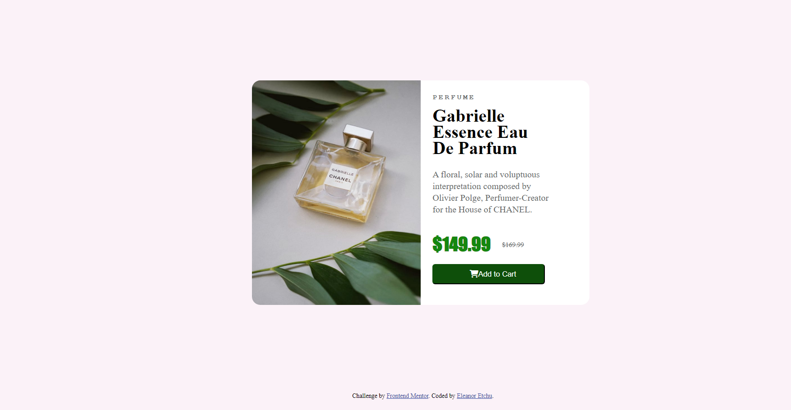

# Frontend Mentor - Product preview card component solution

This is a solution to the [Product preview card component challenge on Frontend Mentor](https://www.frontendmentor.io/challenges/product-preview-card-component-GO7UmttRfa). Frontend Mentor challenges help you improve your coding skills by building realistic projects. 

## Table of contents

- [Overview](#overview)
  - [The challenge](#the-challenge)
  - [Screenshot](#screenshot)
  - [Links](#links)
- [My process](#my-process)
  - [Built with](#built-with)
  - [What I learned](#what-i-learned)
  - [Continued development](#continued-development)
- [Author](#author)

**Note: Delete this note and update the table of contents based on what sections you keep.**

## Overview

### The challenge

Users should be able to:

- View the optimal layout depending on their device's screen size
- See hover and focus states for interactive elements

### Screenshot

### Links

- Solution URL: [Add solution URL here](https://your-solution-url.com)
- Live Site URL: [Add live site URL here](https://your-live-site-url.com)

## My process

### Built with

- Semantic HTML5 markup
- CSS custom properties
- Flexbox
- Media Queries

### What I learned

I learned how to use media queries to change the layout to fit a mobile screen. 

### Continued development

While doing this project, I learned that there is a lot I need further practice on. For example, the page is not very responsive. I was able to use media queries to get the page to look close to the mockup but there was just so much wrong with the final outcome. When you are decreasing the size of the page, the background with the text portion decreases. However the text doesn't wrap around it. I believe I tried to use rem for the font size but the text doesn't move when you resize wit so the text spills out of the background. It overflows. 

I wasn't able to center the background image even though I tried to so that it matched the mobile version mockup. There's still a lot that I need to learn with background images.

When it came to altering the border radius, I wasn't sure how to do that in one fell swoop with the image and the container for the text. So I had to alter the images border-radius first by choosing the sides that I wanted and altering them and then moving to the 
.body container and altering the sides I chose.

The button also was not responsive so that when the page was resized, the button didn't change to fit the page. It remained the full static width.

## Author

- Frontend Mentor - [@EleanorEtchu](https://www.frontendmentor.io/profile/eetchu92)

